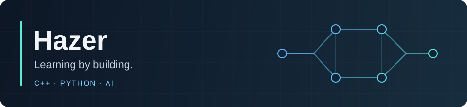

  

  
  
  
  

## Hi, I'm Hazer · 你好，我是 Hazer

I'm a computer science learner at Nanjing University, based in Nanjing, China. I'm interested in artificial intelligence and enjoy understanding how things work by building them.

我在南京大学学习计算机科学，对人工智能感兴趣，也喜欢通过动手构建项目来理解系统如何运作。

## Interests · 兴趣

- **LLM agents & coding tools** — how agents work with code, tools, and repository context.  
  **大模型智能体与编程工具**：探索智能体如何使用代码、工具和仓库上下文。
- **Systems & asynchronous programming** — process execution, clear interfaces, and reliable resource lifetimes.  
  **系统与异步编程**：关注进程执行、清晰的接口和可靠的资源生命周期。
- **AI experiments & research workflows** — resumable tasks, inspectable results, and organized paper notes.  
  **AI 实验与研究工作流**：让任务可以恢复、结果便于检查、文献笔记有序积累。

## Current focus · 目前在做

I'm currently developing **[simplex-cpp](https://github.com/Hazer-BJTU/simplex-cpp)**, a lightweight C++ harness for LLM agents. My focus is on the native worker, extensible tools, process I/O, cancellation, and persistent sessions.

目前主要在开发 **simplex-cpp**，一个轻量的 C++ 大模型智能体框架，关注原生 worker、可扩展工具、进程 I/O、取消机制与会话持久化。

## Projects · 项目

| Project / 项目 | What it does / 简介 |
| --- | --- |
| **[simplex-cpp](https://github.com/Hazer-BJTU/simplex-cpp)** · C++ | A native agent worker with model, tool, and hook plugins, plus a separate Hub and browser interface. 原生智能体 worker，支持模型、工具与 hook 插件，并配套独立 Hub 和浏览器界面。 [Documentation / 文档](https://hazer-bjtu.github.io/simplex-cpp/) |
| **[pyattacker](https://github.com/Hazer-BJTU/pyattacker)** · Python | Resumable asynchronous task orchestration with pipelines, persisted artifacts, retries, and resource pools. 可恢复的异步任务编排，支持流水线、产物持久化、重试与资源池。 [Documentation / 文档](https://hazer-bjtu.github.io/pyattacker/) |
| **[paper-notes](https://github.com/Hazer-BJTU/paper-notes)** · Markdown | A portable collection template and AI skills for turning scientific literature into notes grounded in the original sources. 便于迁移的文献集合模板与 AI skills，用于整理有原文依据的科研笔记。 |

  <a href="https://github.com/Hazer-BJTU">GitHub · Hazer-BJTU</a>

